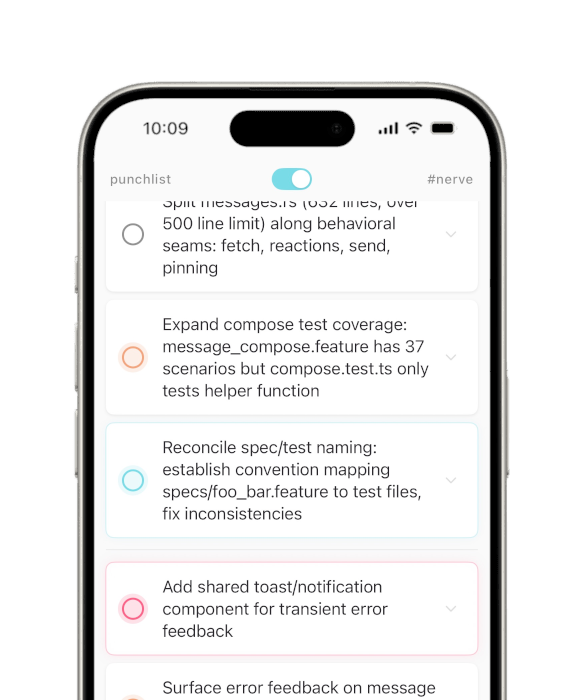

# Punchlist

<p align="center">
  
</p>

<p align="center">
  <em>A task list that stays out of your way.</em>
</p>

---

Most task apps want to be project management software when they grow up. Punchlist doesn't. It's a personal to-do list — fast, opinionated, and intentionally small.

The key insight: **your next action belongs at the bottom of the list, not the top.** Traditional task lists put your most important item as far from your thumb as possible, then ask you to scroll past everything you're avoiding. Punchlist builds from the bottom up. The thing you need to do next is always right there, close at hand.

**Tap an item to finish it.** It gets a checkmark, turns green, and floats to the top of the list — as far away from you as it can get. Done means done; it's out of your way but still visible if you want to see what you've accomplished.

**Pull an item down to make it next.** No drag-and-drop reordering, no priority matrices, no due dates. If something needs to happen next, pull it to the bottom. That's it. One gesture, zero decisions.

**Add from the bottom.** The input bar lives where your thumbs already are. Type, tap done, keep moving. New items land right where they belong — at the front of the queue.

<p align="center">
  
</p>

## Why it works

Punchlist is built on a few deliberate constraints:

- **No local database.** State lives on a server and syncs over WebSocket. Your list is always current, never stale.
- **No offline anxiety.** If you lose connection, mutations queue up in memory and replay when you're back. You never notice.
- **No dependencies.** Zero third-party libraries. URLSession for HTTP, URLSessionWebSocketTask for WebSocket. That's the whole networking stack.
- **No reordering UI.** You can finish things and you can pick what's next. That's the entire interaction model. Fewer choices means less friction.

## Wait, what's that other tab?

<p align="center">
  
</p>

Oh. You found the project drawer. Don't worry about that — those aren't for you. Go back to your personal list. Those teeth aren't going to brush themselves.

...you're still here. Fine. Yes, you can reorder things on the project lists. No, you can't tap to complete them. Bit of a broken experience, really. Not sure why you'd even want to —

Okay, and that toggle at the top? That spawns an agent. It runs a [Knockout](https://github.com/gisikw/knockout) pipeline against the project's task list and starts working through it. The blue one there — see it? — that's the one it's chewing on right now. You can kill the agent any time; that's what the slider is for.

If there's an item it can't figure out, it'll mark it red so you know to look at it later. Those orange ones? Dependencies. Once the agent knocks out the prereqs, it'll get to them. It's fine. It's working. Stop hovering.

Anyway. That's quite enough of that. Best to go back to the personal list. You can always route things to a project with a `#project` tag in the item text if you want. Whoops — forgot to mention that earlier, huh?

Did you remember to flip the laundry?

## Building

Punchlist is a SwiftUI app targeting iOS 17+. Builds happen on a remote macOS host via SSH.

```bash
cp .env.example .env          # fill in real values
just build                    # simulator build
just build-device             # device build
just distribute               # archive + push IPA for ad-hoc distribution
```

## Development

```bash
nix develop                   # enter dev shell
just check                    # type-check Swift without full build
just build                    # full simulator build
```
